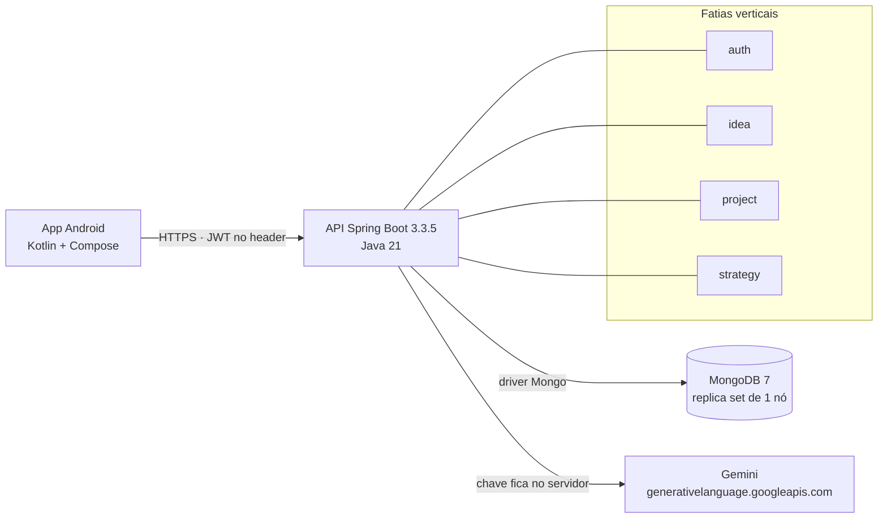
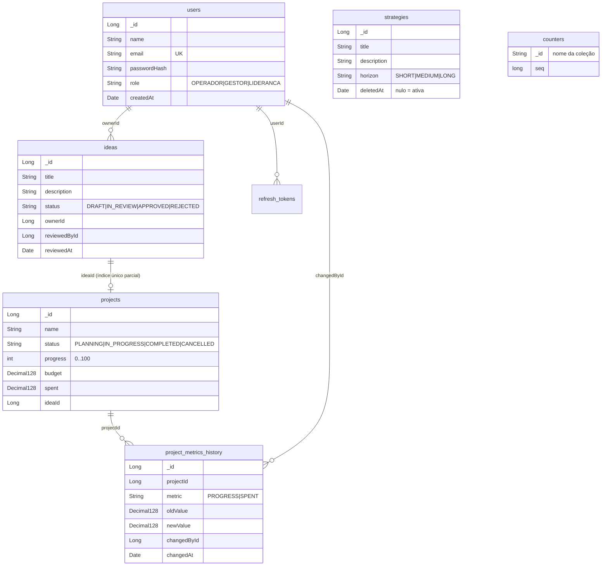
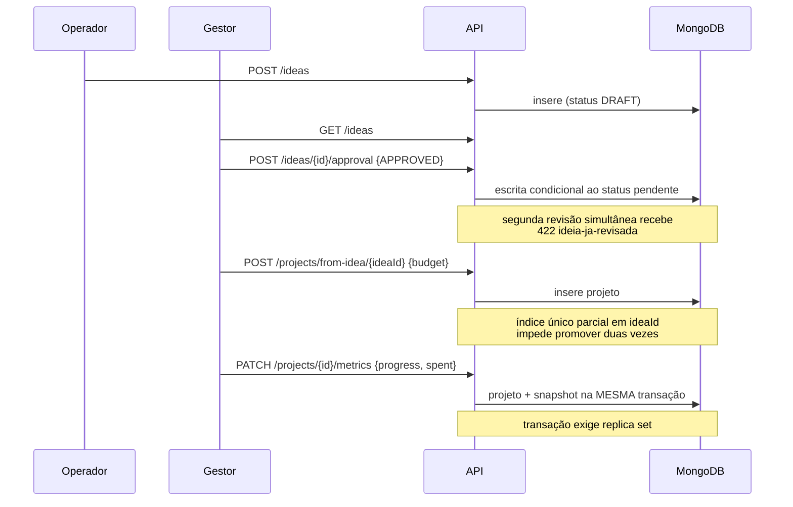

# FIAP-AGUIA-BRANCA — Hub de Inovação

Backend do **Hub de Inovação e Gestão de Projetos Corporativos** da Águia Branca: a API que
recebe ideias da operação, leva cada uma pela decisão do gestor e acompanha as que viram
projeto — com o app Android consumindo tudo isso.

> **Status:** de pé e integrado. As quatro fatias (`auth`, `idea`, `project`, `strategy`) têm
> controller, service, repository e DTOs; a persistência é MongoDB; o app Android consome esta
> API (sem mocks). O backlog de endurecimento e operação está nas [issues](../../issues) e no
> [board](https://github.com/users/AlexCajeFelix/projects/4).

```
 operador ──▶ ideia ──▶ gestor decide ──▶ projeto ──▶ métricas ──▶ painel da liderança
```

---

## O que dá para fazer

**Operador**
- Envia ideia ou relata problema da operação.
- Acompanha o que enviou e em que pé está cada uma (rascunho, em análise, aprovada, recusada).
- Lê as diretrizes estratégicas que a liderança publicou.
- Pede ajuda da IA para transformar o rascunho em um texto claro, antes de enviar.

**Gestor**
- Recebe a fila de ideias esperando decisão e aprova ou recusa — sem poder revisar duas vezes.
- Promove ideia aprovada a projeto, definindo o orçamento.
- Atualiza progresso e gasto; cada alteração vira registro de auditoria.
- Vê os projetos em execução e o histórico de cada métrica.

**Liderança**
- Painel com orçamento total, gasto, projetos por status e distribuição por data.
- Publica, edita e remove diretrizes estratégicas (remoção é *soft delete*: some da leitura, fica no banco).
- Enxerga tudo que gestor e operador enxergam.

**Transversal**
- Login com JWT (30 min) e refresh opaco rotacionado (7 dias); reúso de refresh derruba a sessão inteira.
- Rate limit no login, por IP e por e-mail.
- Erro sempre em RFC 7807, com `X-Request-Id` ligando resposta e log.
- Contrato OpenAPI publicado pelo CI a cada build.

---

## Rodando local

Precisa só de **Docker**. Tudo (banco e API) sobe com um comando:

```bash
./run.sh                 # cria o .env, sobe mongo + API e imprime as credenciais
./run.sh --app           # o mesmo, e ainda instala o app no emulador conectado
./run.sh --down          # derruba tudo
```

Na mão, se preferir:

```bash
cp .env.example .env             # ajuste APP_PORT se a 8080 estiver ocupada
docker compose up -d --build     # mongo:7 + a API, com o seed de desenvolvimento

curl localhost:${APP_PORT:-8080}/actuator/health
```

O profile `dev` está ligado por padrão no compose, então o banco já sobe com usuários, ideias,
projetos e diretrizes de exemplo — dá para entrar no app sem cadastrar nada.

Para desenvolver com recarga rápida, sobe só o banco e roda a API pela JVM local:

```bash
docker compose up -d db          # mongo:7 em replica set de um no

SPRING_PROFILES_ACTIVE=dev ./mvnw spring-boot:run
```

O `--replSet` não é enfeite: transação no MongoDB só existe em replica set, e
`PATCH /projects/{id}/metrics` grava a métrica e o snapshot de auditoria na mesma transação.
Contra um `mongod` avulso esse endpoint é o único que falha.

Subindo o Mongo na mão, em vez do compose:

```bash
docker run -d --name aguiabranca-db -p 27017:27017 mongo:7 --replSet rs0 --bind_ip_all
docker exec aguiabranca-db mongosh --quiet --eval \
  "rs.initiate({_id:'rs0',members:[{_id:0,host:'localhost:27017'}]})"
```

A URI default é `mongodb://localhost:27017/aguiabranca?directConnection=true`. O
`directConnection` evita que o driver leia a lista de membros do replica set (`localhost:27017`,
o endereço visto de dentro do container) e tente conectar nela a partir de fora.

### O segredo do JWT

A aplicação **não sobe** sem `JWT_SECRET`, e recusa segredo com menos de 32 bytes — HS256 assina
com bloco de 256 bits, e chave menor enfraquece a assinatura. Gere o seu:

```bash
openssl rand -base64 48
```

O profile `dev` traz um segredo pronto para não travar quem está começando. Ele é **público**:
está versionado em `application-dev.yml`, então qualquer pessoa que leia o repositório consegue
forjar um token de `LIDERANCA`. Por isso a aplicação recusa o boot se esse valor aparecer com
qualquer profile diferente de `dev`.

Fora de dev, a variável vem do ambiente — `.env.example` lista o que preencher.

Não há migration: no MongoDB o que precisa existir são índices e validadores, e o
`MongoSchemaInitializer` cria os dois de forma idempotente a cada boot. Os validadores
`$jsonSchema` são a tradução dos `CHECK` que o schema SQL tinha — role, status, horizonte e
progresso entre 0 e 100 — e os campos de dinheiro exigem `bsonType: decimal`, que é o alarme
para o dia em que alguém quebrar a conversão e o valor voltar a ser gravado como texto.

O seed de desenvolvimento é o `DevSeedRunner` e **só existe com o profile `dev`** — em produção
essas contas não nascem por construção. Usuários criados pelo seed, um por perfil:

| E-mail | Senha | Perfil |
|---|---|---|
| `operador@aguiabranca.dev` | `operador123` | `OPERADOR` |
| `gestor@aguiabranca.dev` | `gestor123` | `GESTOR` |
| `lideranca@aguiabranca.dev` | `lideranca123` | `LIDERANCA` |

```bash
curl -s localhost:8080/auth/login -H 'Content-Type: application/json' \
  -d '{"email":"gestor@aguiabranca.dev","password":"gestor123"}'
```

O login devolve `accessToken` (30 min) e `refreshToken` (7 dias, opaco, revogável). Quando o
access expirar, `POST /auth/refresh` com o refresh atual troca o par. Cada refresh invalida o
token usado; reusar um já rotacionado revoga a família inteira daquele login (sessão
comprometida) e responde `type` `https://aguiabranca.fiap.br/errors/refresh-invalido`.
`POST /auth/logout` invalida o refresh corrente.

## Rotas

| Método | Rota | Quem pode |
|---|---|---|
| `GET` | `/v3/api-docs` | público (contrato OpenAPI) |
| `POST` | `/auth/login` | público |
| `POST` | `/auth/refresh` | público (body com refresh token) |
| `POST` | `/auth/logout` | público (body com refresh token) |
| `POST` | `/ideas` | qualquer autenticado |
| `GET` | `/ideas?status=` | autenticado — `OPERADOR` só vê as próprias |
| `GET` | `/ideas/{id}` | autenticado — ideia alheia responde 404 para `OPERADOR` |
| `POST` | `/ideas/{id}/approval` | `GESTOR`, `LIDERANCA` |
| `POST` | `/ideas/suggest` | qualquer autenticado — só existe com `GEMINI_API_KEY` |
| `GET` | `/projects` | qualquer autenticado |
| `GET` | `/projects/summary` | qualquer autenticado |
| `GET` | `/projects/{id}` | qualquer autenticado |
| `GET` | `/projects/{id}/metrics-history` | qualquer autenticado |
| `POST` | `/projects/from-idea/{ideaId}` | `GESTOR`, `LIDERANCA` |
| `PATCH` | `/projects/{id}/metrics` | `GESTOR`, `LIDERANCA` |
| `GET` | `/strategies`, `/strategies/{id}` | qualquer autenticado |
| `POST` `PUT` `DELETE` | `/strategies` | `GESTOR`, `LIDERANCA` |

Erro sai em RFC 7807. O campo estável para o cliente decidir comportamento é o **`type`**, nunca
o `title` — que é texto livre e muda.

### O assistente de IA

`POST /ideas/suggest` reescreve o rascunho de uma ideia com o Gemini. A chave fica no servidor
(`GEMINI_API_KEY` no `.env`): embutida no APK, qualquer pessoa a extrairia com `apktool` e
gastaria a cota. **Sem a variável, a fatia inteira fica fora do contexto** e a rota responde
404 — nenhum teste e nenhum build dependem desse segredo.

```bash
curl -s localhost:8081/ideas/suggest -H "Authorization: Bearer $TOKEN" \
  -H 'Content-Type: application/json' \
  -d '{"title":"Fila na inspecao","draft":"caminhao fica parado de manha esperando"}'
```

O prompt proíbe inventar número, prazo ou valor: uma "economia estimada de R$ 300 mil" saída do
modelo entraria no sistema como se fosse análise de quem enviou a ideia.

O tempo de conexao e leitura e limitado por `GEMINI_TIMEOUT` (padrao `PT20S`).
A chave segue no header `x-goog-api-key`, sem aparecer na URL. Apenas respostas terminadas
com `STOP`, sem trechos internos de raciocinio e com ate 2000 caracteres viram sugestoes;
respostas cortadas ou bloqueadas devolvem 502 e o rascunho pode continuar sem IA.

Para proteger a cota, cada usuario tem ate `GEMINI_REQUESTS_PER_MINUTE` chamadas por janela
de um minuto (padrao 6), com no maximo `GEMINI_MAX_CONCURRENT` chamadas simultaneas na API
(padrao 3). Excesso devolve 429 com `Retry-After`. Os limites ficam em memoria por instancia;
varias replicas precisam compartilhar esse controle antes de escalar.

Contrato do provedor: [GenerateContent](https://ai.google.dev/api/generate-content) e
[autenticacao por chave](https://ai.google.dev/gemini-api/docs/api-key).

### Correlation ID

Toda resposta volta com o header **`X-Request-Id`**, e toda linha de log da requisição sai com o
mesmo valor entre colchetes. Se o cliente mandar o header, ele é reaproveitado; se não mandar, a
API gera um UUID.

```
2026-08-27T10:12:03.914-03:00  WARN [app-android-7f3a] 1 --- [nio-8080-exec-2] G.ExceptionHandler : 422 em /projects/12/metrics ...
```

Em resposta de erro o mesmo ID aparece no `instance` do ProblemDetail, como
`urn:request-id:<id>` — então um print de tela do erro basta para achar as linhas de log daquela
requisição exata, sem caçar por horário.

Valor recebido do cliente é limpo antes de entrar no log: acima de 64 caracteres, ou sobrando
vazio depois da limpeza, a API descarta e gera o próprio.

---

---

## Arquitetura



A organização é por **fatia vertical**, não por camada técnica: `domain/idea` tem controller,
service, repository, entidade e DTOs juntos. Mudança de regra de ideia acontece numa pasta só,
e não espalhada por `controllers/`, `services/` e `repositories/`.

O que é infraestrutura de verdade mora em `shared/persistence`: geração de id sequencial,
conversão de dinheiro, índices e validadores, seed de desenvolvimento.

### Por que o app não fala com o Gemini direto

A chave ficaria dentro do APK. Qualquer pessoa extrai com `apktool` e passa a gastar a cota de
quem publicou. O app chama `POST /ideas/suggest`, e o servidor — que já guarda segredo — fala
com o Google.

---

## Modelo de dados

Sete coleções. Sem *join*: a referência é sempre o id, e quem precisa do outro documento busca
explicitamente.



**Id continua `Long`.** O `_id` nativo do Mongo é um ObjectId de 24 hex; trocar mudaria
`/projects/12`, o contrato OpenAPI e o app de uma vez. No lugar do `BIGSERIAL` entra a coleção
`counters` com `findAndModify` e `$inc`, atômico no servidor.

**Dinheiro é `Decimal128`**, nunca texto. O validador da coleção exige `bsonType: decimal` —
é o alarme para o dia em que alguém quebrar a conversão, porque `$sum` sobre string devolve
`null` e o total viraria zero na tela, sem erro nenhum.

**Não há migration.** O que precisa existir são índices e validadores `$jsonSchema`, criados de
forma idempotente a cada boot pelo `MongoSchemaInitializer` — a tradução dos `CHECK` e `UNIQUE`
que o schema SQL tinha.

---

## Os dois fluxos que importam

### Da ideia ao projeto



O status do projeto **não é campo editável**: ele é consequência do progresso — 0 planeja,
1 a 99 executa, 100 conclui.

### Login e rotação do refresh

```mermaid
sequenceDiagram
    participant App
    participant API

    App->>API: POST /auth/login
    API-->>App: accessToken (30 min) + refreshToken (7 dias)
    App->>API: chamadas com Bearer
    API-->>App: 401 quando o access expira
    App->>API: POST /auth/refresh
    API-->>App: par novo; o refresh usado é revogado
    App->>API: POST /auth/refresh (token antigo, reúso)
    API-->>App: 401 refresh-invalido
    Note over API: a família inteira daquele login<br/>é revogada — sinal de roubo
```

A troca é atômica (`findAndModify` condicional): de duas requisições simultâneas com o mesmo
refresh, só uma vence. A outra cai no caminho de reúso.

---

## Documentação viva do contrato

| Onde | O quê |
|---|---|
| `http://localhost:8081/swagger-ui.html` | Swagger UI, com "Try it out" |
| `http://localhost:8081/v3/api-docs` | OpenAPI 3 em JSON |
| `target/openapi.json` | mesmo contrato, gerado no `./mvnw verify` |
| Artefato `openapi` do CI | publicado a cada build, com 30 dias de retenção |

Para autenticar no Swagger: `POST /auth/login`, copie o `accessToken` e cole em **Authorize**.

### Exemplos

```bash
API=http://localhost:8081

# 1. login
TOKEN=$(curl -s $API/auth/login -H 'Content-Type: application/json' \
  -d '{"email":"gestor@aguiabranca.dev","password":"gestor123"}' | jq -r .accessToken)

# 2. criar ideia
curl -s $API/ideas -H "Authorization: Bearer $TOKEN" -H 'Content-Type: application/json' \
  -d '{"title":"Fila na inspecao","description":"Caminhao parado de manha esperando inspecao."}'

# 3. aprovar
curl -s $API/ideas/1/approval -H "Authorization: Bearer $TOKEN" -H 'Content-Type: application/json' \
  -d '{"status":"APPROVED"}'

# 4. promover a projeto
curl -s $API/projects/from-idea/1 -H "Authorization: Bearer $TOKEN" -H 'Content-Type: application/json' \
  -d '{"budget":450000.00}'

# 5. atualizar métricas
curl -s -X PATCH $API/projects/1/metrics -H "Authorization: Bearer $TOKEN" \
  -H 'Content-Type: application/json' -d '{"progress":45,"spent":120000.50}'

# 6. painel
curl -s $API/projects/summary -H "Authorization: Bearer $TOKEN"
```

Resposta de erro, sempre no mesmo formato:

```json
{
  "type": "https://aguiabranca.fiap.br/errors/ideia-ja-promovida",
  "title": "Regra de negocio violada",
  "status": 422,
  "detail": "Ideia 4 já foi promovida a projeto.",
  "instance": "urn:request-id:923e47b5-b636-4ffc-88a0-79d718727f19"
}
```

O campo estável para o cliente decidir comportamento é o **`type`**. `title` é texto livre.

---

## Testes

```bash
./mvnw test                          # unitários + integração
./mvnw verify                        # o anterior + contrato OpenAPI
./mvnw verify -Dopenapi.port=8099    # se a 8080 estiver ocupada
```

**181 testes.** Precisam de Docker: o MongoDB sobe por Testcontainers, um container por JVM.
Não há banco embarcado de mentira — a versão anterior caía para H2 quando faltava Docker, e o
efeito prático era build verde sem banco nenhum.

| Tipo | O que prova |
|---|---|
| Unitário de domínio | regra de ideia e de projeto sem contexto Spring |
| Slice `@DataMongoTest` | agregações do dashboard, id sequencial, dinheiro como decimal |
| Integração `@SpringBootTest` | fluxo completo por MockMvc, com Mongo de verdade |
| Matriz de autorização | **toda rota do Spring MVC precisa estar declarada na matriz** — rota nova sem permissão declarada quebra o build |
| Plano do dashboard | 100k projetos, exige COLLSCAN e menos de 200 ms |
| Isolamento do seed | prova que as contas de desenvolvimento não existem fora do profile `dev` |

---

## O app Android

Fica em [`app-android/`](app-android), no mesmo repositório — Kotlin + Jetpack Compose,
`minSdk 28`, `compileSdk 36`.

```bash
cd app-android
echo "sdk.dir=$HOME/Android/Sdk" > local.properties
./gradlew :app:installDebug          # com um emulador ou aparelho conectado
```

O `BuildConfig.API_BASE_URL` do build de debug aponta para `http://10.0.2.2:8081` — que é como
o emulador enxerga a máquina que hospeda a API. Em aparelho físico, troque pelo IP da máquina
na rede local. O build de release aponta para HTTPS e **não** libera cleartext.

| Camada do app | O que faz |
|---|---|
| `data/ApiConfig` | OkHttp + Retrofit, token no interceptor, refresh automático no `Authenticator` |
| `data/ApiRepository` | única porta de entrada para a API; erro sobe como `ApiException` com a mensagem do backend |
| `data/ApiMappers` | traduz o contrato para o que a tela mostra (status em português, dinheiro em BRL) |
| `data/TokenStore` | par access/refresh em `SharedPreferences` privado |
| `ui/…` | Compose por perfil: `operador`, `gestor`, `lideranca` |

Sessão expirada (refresh recusado ou família revogada) derruba o app para a tela de login
sozinha, em vez de repetir erro sem saída.

### Sem emulador na máquina?

```bash
sdkmanager "platform-tools" "emulator" "platforms;android-36" \
           "build-tools;36.1.0" "system-images;android-36;google_apis;x86_64"
avdmanager create avd -n aguia -k "system-images;android-36;google_apis;x86_64" -d pixel_6
emulator -avd aguia -gpu host &
```

Em Linux, confira que `/dev/kvm` é acessível — sem aceleração o emulador fica inutilizável.

---

## Estrutura

```
src/main/java/br/com/fiap/aguiabranca/
├── domain/
│   ├── ai/           assistente de redação (Gemini), ligado só com chave no ambiente
│   ├── auth/         login, JWT, refresh rotacionado, rate limit, SecurityConfig
│   ├── idea/         ideia e revisão
│   ├── project/      projeto, métricas e auditoria
│   ├── strategy/     diretrizes com soft delete
│   └── user/         usuário e perfis
└── shared/
    ├── persistence/  id sequencial, conversões, índices e validadores, seed de dev
    └── (erros RFC 7807, correlation id, OpenAPI)

app-android/          app Kotlin + Compose que consome esta API
compose.yaml          mongo + API
run.sh                sobe tudo com um comando
```

---

## Índice

- [O que dá para fazer](#o-que-dá-para-fazer)
- [Rodando local](#rodando-local)
- [Rotas](#rotas)
- [Arquitetura](#arquitetura)
- [Modelo de dados](#modelo-de-dados)
- [Os dois fluxos que importam](#os-dois-fluxos-que-importam)
- [Documentação viva do contrato](#documentação-viva-do-contrato)
- [Testes](#testes)
- [O app Android](#o-app-android)
- [Estrutura](#estrutura)
- [Stack alvo](#stack-alvo)
- [Arquitetura pretendida](#arquitetura-pretendida)
- [Como trabalhar aqui](#como-trabalhar-aqui) ← **comece por aqui**
  - [O board](#o-board)
  - [Fluxo completo de uma task](#fluxo-completo-de-uma-task)
  - [Abrindo uma issue nova](#abrindo-uma-issue-nova)
  - [Labels](#labels)
  - [Campos do board](#campos-do-board)
  - [Branches e commits](#branches-e-commits)
  - [Regras da main](#regras-da-main)
- [Milestones](#milestones)
- [Colinha de comandos](#colinha-de-comandos)

---

## Stack alvo

| Camada | Escolha |
|---|---|
| Runtime | Java 21 |
| Framework | Spring Boot 3.3.5 |
| Banco | MongoDB 7 (replica set de um nó) |
| Auth | JWT HS256 (jjwt 0.12) + refresh opaco rotacionado |
| Erros | RFC 7807 (`ProblemDetail`) |
| Testes | JUnit 5 + Testcontainers |
| App cliente | Android (Kotlin + Compose), consumindo esta API |
| IA (opcional) | Gemini via backend, chave só no servidor |

## Arquitetura pretendida

- **Fatias verticais** por domínio: `auth`, `idea`, `project`, `strategy`.
  Cada fatia carrega controller, service, repository, entidades e DTOs próprios.
- **Regras de negócio nas entidades**, não nos services (`Idea.review()`,
  `Project.updateProgress()`).
- **RBAC via `@PreAuthorize`** com três perfis: `OPERADOR`, `GESTOR`, `LIDERANCA`.
- **`AuthenticatedUser` como principal**, com a role carregada como claim do JWT.
- **Auditoria financeira** em `project_metrics_history` — todo `PATCH` de métrica grava snapshot.
- **Erros padronizados** em RFC 7807 por um `GlobalExceptionHandler` central.

---

# Como trabalhar aqui

## O board

**→ https://github.com/users/AlexCajeFelix/projects/4**

Cinco colunas. A regra que mantém o board honesto: **o card mora numa coluna só, e quem move é
quem está com ele na mão.**

| Coluna | O que significa | Quando mover para cá |
|---|---|---|
| **Backlog** | Existe, mas ainda não pode ou não deve começar | Nasce aqui |
| **Pronto** | Destravado, com critério de aceite claro, pode pegar | Quando as dependências fecharam |
| **Em andamento** | Alguém está tocando **agora** | Ao criar a branch |
| **Em revisão** | PR aberto esperando review | Ao abrir o PR |
| **Concluído** | Mergeado e validado | Merge do PR (automático, ver abaixo) |

**Limite de trabalho em paralelo:** no máximo **2 cards** em `Em andamento` por pessoa. Mais que
isso e nada termina — só existe coisa pela metade.

Se um card está em `Em andamento` e você parou de mexer nele, mova de volta para `Pronto`. Card
parado em andamento é a mentira mais comum de board de Kanban.

### Mover um card

**Pelo navegador (o jeito normal):** arraste o card entre as colunas.

**Pelo terminal**, se você já está no fluxo do `gh`:

```bash
# 1) achar o ID do item (o card) a partir do numero da issue
gh project item-list 4 --owner @me --format json \
  | jq -r '.items[] | select(.content.number == 15) | .id'

# 2) mover para "Em andamento"
gh project item-edit \
  --id <ITEM_ID_DO_PASSO_1> \
  --project-id PVT_kwHOC3YJlc4BgXof \
  --field-id PVTSSF_lAHOC3YJlc4BgXofzhakCuM \
  --single-select-option-id f5cb7ae8
```

Os IDs das colunas (nada disso é adivinhável, por isso está anotado aqui):

| Coluna | `--single-select-option-id` |
|---|---|
| Backlog | `d2215c36` |
| Pronto | `ee5638cc` |
| Em andamento | `f5cb7ae8` |
| Em revisão | `5183676e` |
| Concluído | `f0a034ae` |

> Se algum dia esses IDs não baterem, **não invente** — releia com
> `gh project field-list 4 --owner @me --format json`.

### Fechamento automático

O card vai sozinho para `Concluído` quando o PR que diz `Closes #N` é mergeado. É por isso que
o `Closes #` no template de PR não é enfeite: sem ele, você fecha a issue na mão e o board
desatualiza.

---

## Fluxo completo de uma task

Do "peguei" ao "acabou". Exemplo com a issue **#15**.

### 1. Pegue o card

Escolha algo em **`Pronto`** — não em `Backlog`. Se está no Backlog, ou tem dependência aberta ou
ninguém ainda decidiu que vale a pena.

```bash
gh issue view 15                      # leia o critério de aceite ANTES de codar
gh issue edit 15 --add-assignee @me
```

Mova o card para **`Em andamento`**.

### 2. Crie a branch

Sempre a partir da `main` atualizada:

```bash
git checkout main
git pull
git checkout -b test/integracao-ideias
```

### 3. Trabalhe, commitando pequeno

```bash
git add -A
git commit -m "test(idea): cobre submissao e listagem filtrada"
```

O critério de aceite da issue é a sua checklist. Vá marcando os checkboxes na própria issue
conforme fecha cada item — dá visibilidade sem ninguém precisar perguntar "como tá?".

### 4. Rode o build antes de abrir o PR

```bash
./mvnw -q verify

# 8080 ocupada na sua máquina? A geração do contrato OpenAPI sobe a app nessa porta:
./mvnw -q verify -Dopenapi.port=8099
```

Abrir PR vermelho gasta o tempo de quem revisa.

### 5. Abra o PR

```bash
git push -u origin test/integracao-ideias
gh pr create --fill
```

Preencha o template — principalmente o **`Closes #15`** e o **como validar**. Mova o card para
**`Em revisão`**.

### 6. Review

Comentário pendente **bloqueia o merge** (a `main` exige conversas resolvidas). Resolva ou
responda cada um.

### 7. Merge

```bash
gh pr merge --squash --delete-branch
```

Use **squash**: a `main` exige histórico linear, então merge commit é rejeitado.

O card vai para `Concluído` sozinho por causa do `Closes #15`. Fim.

---

## Abrindo uma issue nova

**Pelo navegador:** *Issues → New issue* → escolha **Bug** ou **Feature**. Os templates já pedem
área, contexto e critério de aceite nos campos certos.

**Pelo terminal:**

```bash
gh issue create \
  --title "Cache de resposta do dashboard" \
  --label tipo:feat --label area:backend --label p2 --label size:m \
  --milestone "M3 — Operação"
```

Depois adicione ao board:

```bash
gh project item-add 4 --owner @me \
  --url https://github.com/AlexCajeFelix/FIAP-AGUIA-BRANCA/issues/28
```

### O que faz uma issue boa aqui

Toda issue segue três seções:

```markdown
## Contexto
Por que isso existe — 2-3 linhas, citando arquivos reais.

## Critério de aceite
- [ ] item verificável
- [ ] item verificável

## Notas técnicas
Armadilhas, arquivos a tocar, comandos.
```

**A regra do critério de aceite:** cada checkbox tem que ser verificável por alguém que não
escreveu o código.

| ❌ Não serve | ✅ Serve |
|---|---|
| "funcionar corretamente" | "`GET /ideas/{id}` de ideia alheia responde 404 para `OPERADOR`" |
| "estar seguro" | "app não sobe se `JWT_SECRET` tiver menos de 32 bytes" |
| "ter boa performance" | "query executa em menos de 200 ms com 100k projetos" |

Se você não consegue escrever como verificar, a issue ainda não está pronta para sair do Backlog.

---

## Labels

Quatro famílias. **Toda issue leva uma de cada** — é o que faz os filtros funcionarem.

| Família | Valores | Para quê |
|---|---|---|
| **Tipo** | `tipo:feat` `tipo:fix` `tipo:chore` `tipo:docs` `tipo:test` `tipo:seguranca` | Natureza do trabalho |
| **Área** | `area:backend` `area:android` `area:infra` `area:banco` | Onde encosta |
| **Prioridade** | `p0` `p1` `p2` | Ordem de ataque |
| **Tamanho** | `size:s` `size:m` `size:l` | Esforço estimado |

**Prioridade:**

- `p0` — **bloqueia outras frentes.** Alguém está parado por causa disso.
- `p1` — importante, entra no ciclo atual.
- `p2` — pode esperar sem prejuízo.

**Tamanho:**

- `size:s` — até meio dia
- `size:m` — 1 a 2 dias
- `size:l` — 3 dias ou mais → **considere quebrar em issues menores**

Filtrando:

```bash
gh issue list --label p0 --state open              # o que trava o time
gh issue list --label area:android                 # backlog do app
gh issue list --milestone "M1 — Repo e CI"
gh issue list --search "no:assignee label:p0"      # p0 sem dono
```

---

## Campos do board

Além do Status, cada card tem dois campos próprios:

| Campo | Tipo | Valores |
|---|---|---|
| **Área** | seleção | Backend, Android, Infra, Banco |
| **Estimativa** | número | pontos de esforço |

A **Estimativa** segue o tamanho, para o board somar por coluna:

| Label | Estimativa |
|---|---|
| `size:s` | 1 |
| `size:m` | 3 |
| `size:l` | 5 |

No board dá para agrupar por `Área` em vez de Status (**⋯ → Group by**) quando você quer olhar
só a frente Android, por exemplo.

---

## Branches e commits

### Branches

Sempre a partir da `main`, no formato `<tipo>/<slug-curto>`:

```
feat/refresh-token
fix/tipo-count-jpql
chore/maven-wrapper
docs/guia-contribuicao
test/matriz-rbac
```

Uma branch por issue. Branch de vida longa vira conflito de merge.

### Commits

[Conventional Commits](https://www.conventionalcommits.org/) — `<tipo>(<escopo>): <o que muda>`:

```
feat(idea): adiciona endpoint de aprovacao
fix(project): corrige tipo do COUNT na constructor expression
chore(ci): adiciona cache de dependencias maven
test(auth): cobre token expirado e assinatura invalida
docs(readme): documenta fluxo do board
```

Escopo é a fatia ou o módulo (`idea`, `project`, `auth`, `strategy`, `ci`, `android`).
Escreva no **imperativo** e descreva o efeito, não o arquivo: `corrige tipo do COUNT`, não
`altera ProjectRepository`.

---

## Regras da main

A `main` é protegida — **e a regra vale para admin também**, então não adianta ser o dono do repo.

| Regra | Efeito prático |
|---|---|
| Push direto bloqueado | `git push origin main` é rejeitado com `GH006` |
| PR obrigatório | Todo código entra por PR |
| Histórico linear | Merge commit rejeitado — **use `--squash`** |
| Conversas resolvidas | Comentário pendente trava o merge |
| Force push bloqueado | Não dá para reescrever o histórico |
| Deleção bloqueada | A `main` não some por acidente |

Se você tentar `git push origin main` e vir isso, **está tudo certo**:

```
remote: error: GH006: Protected branch update failed for refs/heads/main.
remote: - Changes must be made through a pull request.
```

Commitou na `main` local por engano? Leve o trabalho para uma branch:

```bash
git branch minha-branch      # salva o ponto atual
git reset --hard origin/main # limpa a main local
git checkout minha-branch
```

### Ainda não está ligado

Duas regras ficaram de fora de propósito, e a issue [#5](../../issues/5) existe para fechá-las:

- **CI verde obrigatório** — depende do workflow da [#3](../../issues/3) existir. Não dá para
  exigir um check que nunca rodou: isso travaria todo PR permanentemente.
- **Aprovação obrigatória** — hoje há um único colaborador com write, e o GitHub não deixa
  ninguém aprovar o próprio PR. Sobe para 1 assim que entrar a segunda pessoa.

---

## Milestones

| Milestone | Objetivo | Issues |
|---|---|---|
| **M1** — Repo e CI | Build reproduzível e pipeline verde | [#1–#5](../../milestone/1) |
| **M2** — Endurecimento | Segurança e config prontas para ambiente real | [#6–#10](../../milestone/2) |
| **M3** — Operação | Observabilidade, empacotamento, performance | [#11–#14](../../milestone/3) |
| **M4** — Testes | Cobertura por fatia e matriz de RBAC | [#15–#19](../../milestone/4) |
| **M5** — Integração Android | App sai do mock e passa a consumir a API | [#20–#26](../../milestone/5) |

A ordem não é rígida entre M2, M3 e M4 — mas **M1 vem antes de tudo**, e o M5 depende do
contrato OpenAPI da [#20](../../issues/20) estar publicado.

---

## Colinha de comandos

```bash
# --- ver trabalho ---
gh issue list --state open                    # tudo que está aberto
gh issue list --label p0                      # o que bloqueia
gh issue list --assignee @me                  # o que é meu
gh issue view 15                              # ler uma issue
gh project item-list 4 --owner @me            # o board no terminal

# --- pegar uma task ---
gh issue edit 15 --add-assignee @me
git checkout main && git pull
git checkout -b test/integracao-ideias

# --- entregar ---
./mvnw -q verify
git push -u origin test/integracao-ideias
gh pr create --fill
gh pr checks                                  # o CI passou?
gh pr merge --squash --delete-branch

# --- inspecionar o board (quando os IDs mudarem) ---
gh project field-list 4 --owner @me --format json
gh project item-list 4 --owner @me --format json
```

> `gh project` exige os scopes `project` e `read:project` no token. Se der erro de scope:
> `gh auth refresh -s project,read:project,workflow,repo`
